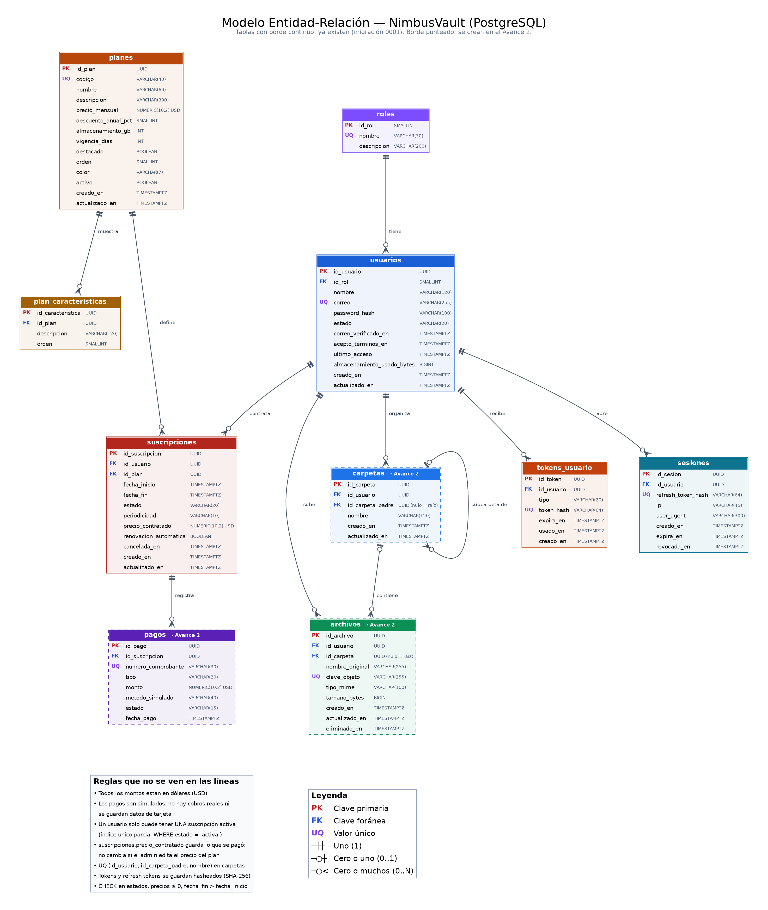
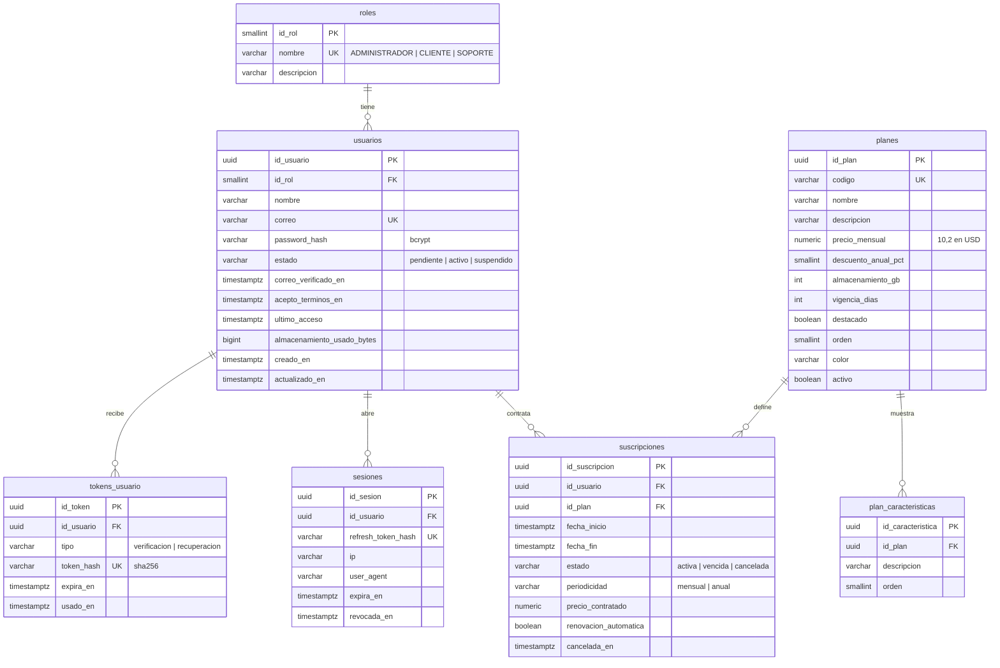

# Base de datos

La fuente de verdad es el código: los modelos en `backend/app/modules/*/models.py` y las migraciones en `backend/alembic/versions/`. Este documento resume el modelo y sirve de base para actualizar el diagrama ER del documento de diseño.

## Diagrama completo

Borde continuo: tablas que ya existen (migración `0001`). Borde punteado: se crean en el Avance 2.
Para regenerarlo después de cambiar un modelo: `python docs/diagramas/er.py` (necesita Graphviz). También está en SVG por si lo quieren meter al documento sin que se pixele.

## Tablas del Avance 1 (detalle)

### Restricciones importantes

- `usuarios.correo` único y siempre guardado en minúsculas.
- `suscripciones`: índice único parcial `(id_usuario) WHERE estado = 'activa'`. Un usuario no puede tener dos planes activos.
- CHECK en estados, precios (≥ 0), almacenamiento (> 0) y fechas (`fecha_fin > fecha_inicio`).
- Borrar un usuario borra en cascada sus tokens, sesiones y suscripciones. Un plan con suscripciones no se puede borrar (FK sin cascada).

### Moneda y pagos

No hay columna de moneda: **todos los montos del sistema están en dólares (USD)**. Los pagos son una simulación (como dice la propuesta, sección 3.2): no se procesa dinero real ni se guarda el número de tarjeta.

## Cambios respecto al ER de la primera entrega

| Antes | Ahora | Por qué |
|---|---|---|
| `roles` 1:1 `usuarios` | 1:N | Un rol lo tienen muchos usuarios |
| `usuarios.nombre` + `apellido` | `nombre` (completo) | El formulario de registro pide un solo campo |
| No había cómo validar correo ni recuperar contraseña | `tokens_usuario` | RF-02 y RF-04 |
| No había sesiones | `sesiones` | "Manejo de sesiones" del lineamiento; permite cerrar sesión de verdad |
| `planes.almacenamiento_gb, precio, vigencia_dias, estado` | Se agregan `codigo`, `destacado`, `orden`, `color`, `descuento_anual_pct` y la tabla `plan_caracteristicas` | Las tarjetas del landing y del catálogo se arman desde la BD |
| `suscripciones` sin precio | `precio_contratado`, `periodicidad`, `renovacion_automatica` | El precio pagado no cambia si el admin edita el plan |
| Sin campo de consumo | `usuarios.almacenamiento_usado_bytes` | Mostrar el consumo sin sumar todos los archivos en cada consulta |

## Pendiente para el Avance 2

Ya están en el diagrama con borde punteado:

- `carpetas`: `id_carpeta_padre` nulo significa que está en la raíz. UQ `(id_usuario, id_carpeta_padre, nombre)`.
- `archivos`: `id_carpeta` nulo = raíz. `clave_objeto` es la llave del objeto en MinIO. `eliminado_en` sirve para la papelera.
- `pagos`: `numero_comprobante` único (ej. `INV-2026-0091`), `tipo` (contratación / renovación / cambio de plan). `metodo_simulado` guarda solo algo como "Visa •••• 4821", nunca el número completo.

Decisiones que el equipo tiene que tomar antes:

- **Organizaciones**: ¿entran o no? Si entran, la suscripción tiene que poder pertenecer a una organización. Si no, se quitan del ER.
- **Compartidos**: ¿se mantiene? No está en el alcance de la propuesta.
- **Plan vencido**: ¿qué pasa con los archivos? Sugerencia: quedan en solo lectura hasta renovar.
